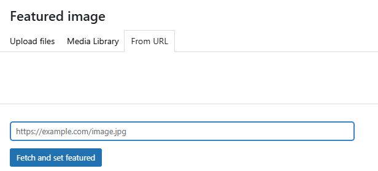

# Featured Image From URL

🖼️ A tiny WordPress plugin (5.8+) that lets you set a featured image directly from any image URL... without leaving the editor or reloading the page. Built to save time when you already have an image link handy.

## Demo

▶️ [Watch the demo video](https://www.awesomescreenshot.com/video/43200081?key=365c86286c2d4bb74f20db58c807b14e)

## Features
- Adds a **“From URL”** tab inside the Media Modal.
- Paste any direct image URL → automatically sideloads to the Media Library.
- Instantly sets it as the featured image.
- Works in **Classic Editor** and **Block Editor (Gutenberg)**.
- Uses core WordPress functions (`media_sideload_image`) with proper nonce and capability checks.
- Validates URL, content type, and file size before downloading.

## Requirements
- WordPress 5.8+
- PHP 7.4+
- User must have the `upload_files` capability.

## Installation
1. Download the [latest release](https://github.com/HasheCS/wp-featured-image-from-url/releases).
2. Upload and activate via **Plugins → Add New → Upload Plugin** in your WordPress admin.
3. Open the post editor → “Set Featured Image” → select **From URL** tab.
4. Paste your image URL and click **Fetch and set featured**.

## Roadmap
- Bulk insert featured images from a list of URLs.
- More editor integration (e.g. sidebar quick set).
- Additional image type support (SVG, AVIF) — with safe handling.

## Contributing
Pull requests are welcome. For major changes, please open an issue first to discuss what you’d like to change.

## License
[MIT](LICENSE)
